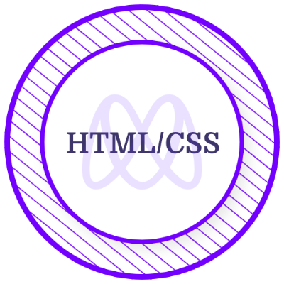
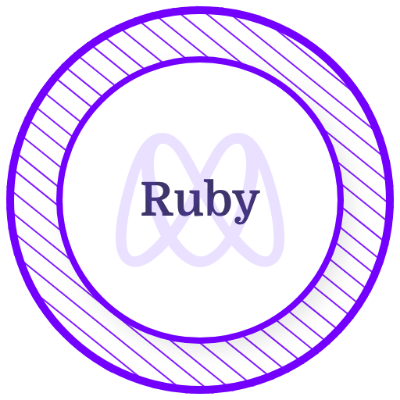
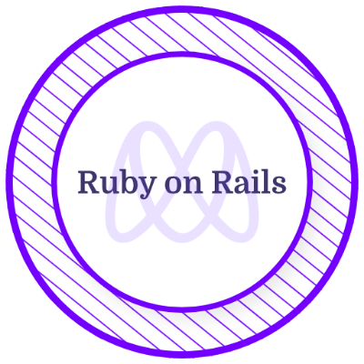

<h1 align="center">Hello🤗, I am Winfred Edube</h1>
 
  

### Here's A Little About Me...
- 📚 Lifelong Learner: I'm always seeking opportunities to expand my knowledge and skills, both in web development and other areas of interest.
- 🎧 Music Enthusiast: Besides coding and reading, I'm passionate about music. I enjoy exploring different genres
- 🎨 Creative Coding: I believe in adding a touch of creativity to my coding projects.  I aim to make my code an art form.
- 💡 Entrepreneurial Spirit: Beyond the technical aspects, I'm eager to explore how my coding skills can contribute to entrepreneurial ventures
- 🤝 Open to Learning: I'm always open to different viewpoints and techniques, valuing the mutual growth that comes from teamwork.
- 🏆 Goal-driven: Constantly setting milestones to measure my progress and ensure I'm on track to achieve my aspirations.
- 🎓 Educational Background: Full-stack Development student at Microverse, a remote school that uses pair programming to teach development
   
  
  <h2>My stats⚡</h2>

| | |
| :---: | :---: |
|  |  | 
|  |  |
 

<h2>Tech & Tools Preference🛠</h2>

  

<h2>Licence & Certicifications👩‍🎓</h2>

 
 <h2>Let's connect☺</h2>
  

      
 
 
   

   

